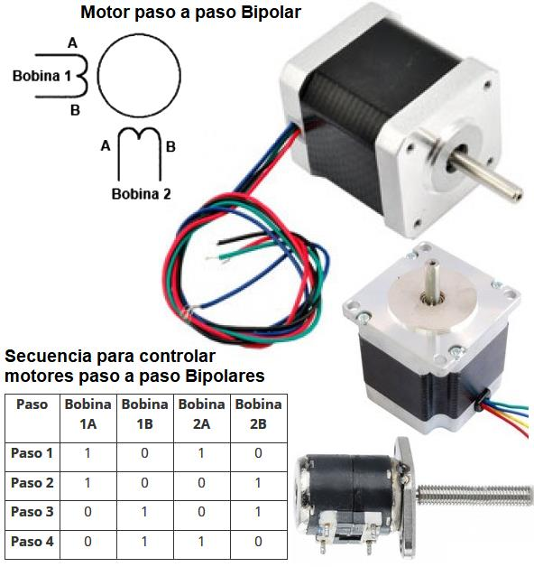
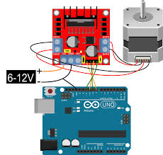
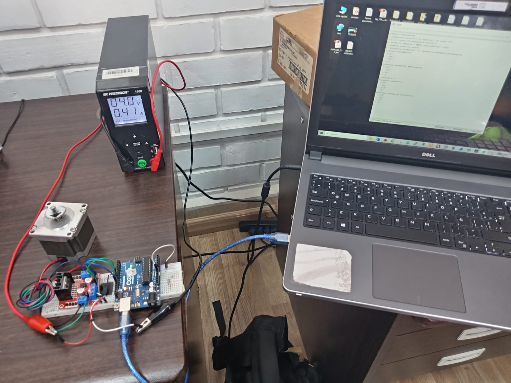

# MotorPasoAPasoNAPO
# Control de Motor Paso a Paso con Arduino

**Facultad de Ciencias y Tecnología - Universidad San Francisco Xavier de Chuquisaca (USFX)**

**Noelia Alejandra Párraga Ortuzte**  

**Ingeniería en Telecomunicaciones**  

---

Este proyecto permite controlar un motor paso a paso **Nema 17 bipolar** mediante comandos seriales utilizando un **Arduino Nano** y un controlador **L298N**, empleando la librería `Stepper.h`.

---

## 📦 Componentes Utilizados

- Arduino Nano  
- Motor Nema 17 (bipolar, 200 pasos/rev)  
- Módulo puente H L298N  
- Fuente de alimentación externa (para el motor)  
- Cables de conexión  
- Software: Arduino IDE  

---

## ⚙️ Descripción del Proyecto

El sistema permite controlar el giro del motor paso a paso en intervalos de 90°, representando posiciones de 0°, 90°, 180° y 270°. También se puede realizar rotaciones completas, ajustar velocidad de rotación y ejecutar secuencias automáticas horarias y antihorarias.

### 🔧 Funcionalidades principales:

- Movimiento entre posiciones fijas  
- Control de dirección de giro  
- Reinicio a posición 0°  
- Rotación de 360°  
- Cambio dinámico de velocidad por comandos  
- Modo automático de secuencias  

---

## ⚙️ ¿Cómo Funciona un Motor Paso a Paso Bipolar?

Un **motor paso a paso bipolar** es un tipo de motor eléctrico diseñado para mover un eje en incrementos muy pequeños, llamados "pasos". Estos motores son ideales para aplicaciones donde se requiere un control preciso de la posición y el movimiento.

### 1. **Estructura del Motor Paso a Paso Bipolar**
El motor paso a paso bipolar consta de dos devanados (bobinas) en el estator que generan campos magnéticos cuando se les aplica corriente. A diferencia de los motores unipolares, los motores bipolares requieren que la corriente fluya en ambas direcciones a través de las bobinas, lo que les da más torque y control de posición.

### 2. **Principio de Funcionamiento**

El funcionamiento básico del motor paso a paso bipolar se basa en la interacción de los campos magnéticos generados por las bobinas (estator) y el rotor (la parte móvil del motor):

- **Secuencia de Energización**: El controlador de motor (el L298N) energiza las bobinas en una secuencia específica. Esto crea un campo magnético en las bobinas que interactúa con el rotor, lo que lo hace girar en pequeños incrementos.
- **Movimiento del Rotor**: El rotor tiene imanes permanentes que se alinean con los campos magnéticos generados por las bobinas. Al cambiar la polaridad de las bobinas, el rotor avanza un "paso". Cada paso corresponde a un movimiento de 1.8° en el caso de un motor con 200 pasos por revolución (como el **Nema 17 bipolar**).
  
### 3. **Secuencia de Pasos**

Los motores paso a paso funcionan mediante la activación secuencial de las bobinas, de manera que el rotor se mueve un paso a la vez. Aquí te explicamos cómo funciona:

1. **Energización de las bobinas**: El controlador L298N envía corriente a las bobinas del motor en un orden específico, generando campos magnéticos que hacen que el rotor se mueva.
2. **Movimiento de 1.8° por paso**: En motores comunes, cada ciclo completo de activación de las bobinas produce un movimiento de 1.8°, es decir, 200 pasos por vuelta completa (360°).
3. **Dirección de giro**: Cambiar la secuencia de activación de las bobinas (invertir la polaridad) cambia la dirección del movimiento del motor.
4. **Control de velocidad**: Al variar la velocidad con la que se activan las bobinas, se puede controlar la velocidad de rotación del motor.

### 🌀 Secuencia de pasos

  

### 🔄 Principio de funcionamiento:

1. **Fase 1 (A+ B−):** El campo magnético atrae un diente del rotor alineándolo con el estator.
2. **Fase 2 (A− B−):** La corriente se invierte en una de las bobinas, el campo magnético cambia y el rotor avanza un paso.
3. **Fase 3 (A− B+):** Inversión en ambas bobinas, el rotor sigue avanzando.
4. **Fase 4 (A+ B+):** Se vuelve a invertir para completar la secuencia.

Cada uno de estos cambios representa un **paso** del motor. En este proyecto, se utilizan **200 pasos por vuelta**, lo que equivale a **1.8° por paso**, y se agrupan en **50 pasos por cada 90°**.

Este tipo de motor es ideal para aplicaciones donde se requiere **precisión en el movimiento**, como impresoras 3D, CNCs o robótica.

---

## 🔌 Conexión de Pines

### 🧾 Diagrama de Conexión

| Componente         | Conexiones     | Conecta a Arduino | Nota                             |
|--------------------|----------------|-------------------|----------------------------------|
| Bobina A (Nema 17) | IN1, IN3 (L298N)| D8, D10           | Conectadas en orden de fase      |
| Bobina B (Nema 17) | IN2, IN4 (L298N)| D9, D11           | Conectadas en orden de fase      |
| ENA / ENB          | -              | Activar con puente| Puentes soldados o jumper activo |
| GND                | -              | GND               | Compartido con Arduino           |
| VCC Motor          | -              | Fuente externa    | Según voltaje del motor          |

---

## 💻 Diagrama de Conexión

  

---

## 🛠️ Montaje en Laboratorio

  
    
  

---

## 🔁 Funcionamiento del Sistema

  

---

## 🧪 Comandos Seriales Disponibles

| Comando | Descripción                            |
|---------|----------------------------------------|
| `F`     | Avanza 90° (posición siguiente)        |
| `D`     | Retrocede 90° (posición anterior)      |
| `S`     | Regresa a posición 0°                  |
| `0–3`   | Mueve a una posición específica        |
| `R`     | Gira 360° completos                    |
| `V###`  | Cambia la velocidad (ej: `V120`)       |
| `P`     | Muestra la posición actual             |
| `A`     | Ejecuta una secuencia automática horaria    |
| `B`     | Ejecuta una secuencia automática antihoraria|

